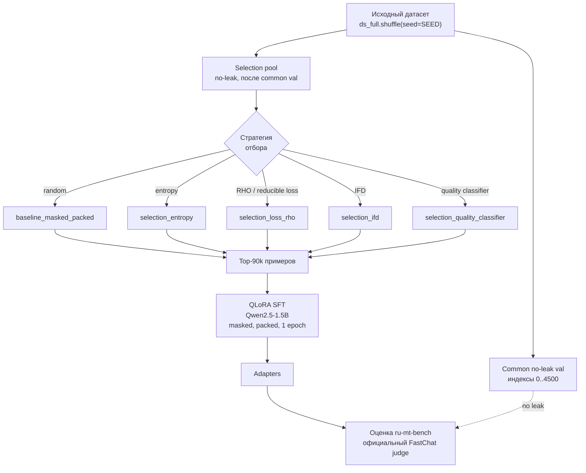
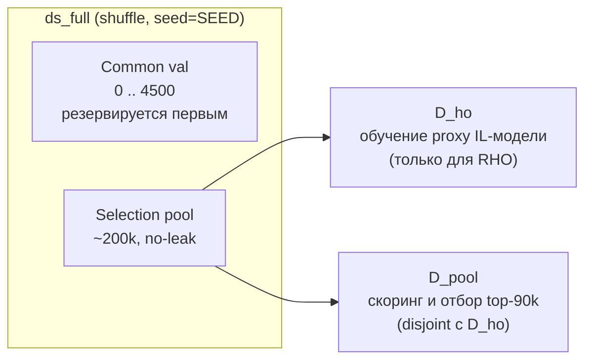

# Публичные тетрадки дипломного эксперимента

[](https://github.com/CHB-0r1s/diploma-public/actions/workflows/ci.yml)
[](https://www.python.org/)
[](https://github.com/astral-sh/ruff)
[](LICENSE)

<!-- Place this tag where you want the buttons to render (GitHub Buttons — https://buttons.github.io/). -->
<a class="github-button" href="https://github.com/CHB-0r1s/diploma-public" data-icon="octicon-star" data-show-count="true" aria-label="Star CHB-0r1s/diploma-public on GitHub">Star</a>
<a class="github-button" href="https://github.com/CHB-0r1s/diploma-public/fork" data-icon="octicon-repo-forked" data-show-count="true" aria-label="Fork CHB-0r1s/diploma-public on GitHub">Fork</a>
<a class="github-button" href="https://github.com/CHB-0r1s/diploma-public/subscription" data-icon="octicon-eye" data-show-count="true" aria-label="Watch CHB-0r1s/diploma-public on GitHub">Watch</a>
<a class="github-button" href="https://github.com/CHB-0r1s" data-show-count="true" aria-label="Follow @CHB-0r1s on GitHub">Follow @CHB-0r1s</a>
<!-- Place this tag in your head or just before your close body tag. -->
<script async defer src="https://buttons.github.io/buttons.js"></script>

Эта папка содержит финальные версии тетрадок для дипломной работы по сравнению стратегий отбора данных для SFT русскоязычной LLM. Тетрадки очищены от outputs, execution counts и временной metadata, чтобы их можно было безопасно перенести в публичный GitHub-репозиторий.

Источник: локальный репозиторий `/Users/boris/Documents/diploma/CHB-0r1s-diploma`, commit `5510fe0`.

## Схема эксперимента



## Разбиение данных (no-leak)



`D_ho` и `D_pool` используются в `selection_loss_rho.ipynb`; для остальных стратегий скоринг идёт напрямую по selection pool. Common-val примеры недоступны для скоринга и отбора во всех стратегиях.

## Общий протокол

- Базовая модель target-обучения: `Qwen/Qwen2.5-1.5B`.
- Обучение: QLoRA, assistant-only masked loss, packing, `SUBSAMPLE_SIZE = 90_000`, `NUM_EPOCHS = 1`.
- Precision: только bf16; если bf16 недоступен, тетрадки должны останавливаться без fallback на fp16.
- Chat template: явно фиксируется Qwen2.5 ChatML через `get_chat_template(..., "qwen-2.5")`; не используется неявный stock `apply_chat_template`.
- Валидация: общий no-leak common val резервируется до построения train/selection pools: `ds_full.shuffle(seed=SEED)[0:4500]`.
- Selection pool: no-leak pool начинается после common val; common-val примеры недоступны для скоринга и отбора.
- Артефакты обучения сохраняются в Google Drive, обычно в `MyDrive/diploma/outputs/...`.

### Ключевые параметры

| Параметр | Значение |
|----------|----------|
| Base model | `Qwen/Qwen2.5-1.5B` |
| Метод обучения | QLoRA, assistant-only masked loss, packing |
| `SUBSAMPLE_SIZE` | 90 000 |
| `NUM_EPOCHS` | 1 |
| Precision | только bf16 (без fallback на fp16) |
| Chat template | Qwen2.5 ChatML (`get_chat_template(..., "qwen-2.5")`) |
| Common val | `ds_full.shuffle(seed=SEED)[0:4500]` |
| Selection pool | no-leak, начинается после common val |
| Judge (eval) | официальный FastChat loop на `t-tech/ru-mt-bench` |

## Стратегии отбора: сравнение

| # | Стратегия | Тетрадка | Критерий скоринга | Что отбирается | Особенности |
|---|-----------|----------|-------------------|----------------|-------------|
| 1 | Random baseline | `baseline_masked_packed` | — (случайно) | 90k unique | reference-точка для сравнения |
| 2 | Entropy | `selection_entropy` | средняя entropy base-модели на assistant-токенах | top-90k из ~200k pool | model-based uncertainty |
| 3 | RHO / reducible loss | `selection_loss_rho` | `L_base − L_IL` | top-90k из `D_pool` | требует proxy IL-модель, обученную на `D_ho` |
| 4 | IFD | `selection_ifd` | `IFD = PPL(y\|x) / PPL(y)` | top-90k по assistant-токенам | скоринг вынесен в `ifd_select.py`, резюмируемый кеш |
| 5 | Quality classifier | `selection_quality_classifier` | оценка Qwen2.5-0.5B scorer'а | top-90k по quality | обучен на Claude-labeled 3k subset |

## Тетрадки

Запускать в таком порядке:

1. [`baseline_masked_packed.ipynb`](notebooks/baseline_masked_packed.ipynb)  
   Random baseline: masked assistant-only loss, packing, 90k unique examples, 1 epoch, common no-leak val.

2. [`selection_entropy.ipynb`](notebooks/selection_entropy.ipynb)  
   Entropy selection: top-90k из no-leak 200k pool по средней entropy base-модели на assistant-токенах.

3. [`selection_loss_rho.ipynb`](notebooks/selection_loss_rho.ipynb)  
   RHO / reducible loss: proxy IL-модель обучается на `D_ho`, затем top-90k выбираются из disjoint `D_pool` по `L_base - L_IL`.

4. [`selection_ifd.ipynb`](notebooks/selection_ifd.ipynb)  
   IFD selection: top-90k по `IFD = PPL(y|x) / PPL(y)` на assistant-токенах.  
   Скоринг и отбор вынесены в компаньон-модуль [`ifd_select.py`](notebooks/ifd_select.py) (`IFDSelector`): подаёшь готовые `(model, tok)` — получаешь IFD-скоры и индексы top-K, с резюмируемым кешем скоров. Ядро model-agnostic, дефолтные chat-маркеры под Qwen-2.5.

5. [`selection_quality_classifier.ipynb`](notebooks/selection_quality_classifier.ipynb)  
   Quality classifier: Claude-labeled 3k subset -> Qwen2.5-0.5B quality scorer -> top-90k quality selection.

6. [`eval_ru_mt_bench_fastchat_official.ipynb`](notebooks/eval_ru_mt_bench_fastchat_official.ipynb)  
   Оценка обученных моделей на `t-tech/ru-mt-bench` через официальный FastChat judge loop. Кастомная часть только генерирует ответы из локальных Unsloth LoRA adapters в FastChat-compatible `model_answer/*.jsonl`.

## Требования к запуску

- Google Colab или совместимая среда с CUDA GPU, поддерживающим bf16: A100, L4, H100 или другой `sm_80+`.
- Google Drive для сохранения чекпоинтов и финальных adapters.
- Доступ к Hugging Face datasets/models.
- Для `selection_quality_classifier.ipynb`: `ANTHROPIC_API_KEY` в переменной окружения или Colab Secrets.
- Для `eval_ru_mt_bench_fastchat_official.ipynb`: `OPENAI_API_KEY` для GPT judge или `ANTHROPIC_API_KEY` для Claude judge, если judge model переключён на Claude.

Ключи API не должны записываться в тетрадки. Используйте переменные окружения или Colab Secrets.

## Разработка и тесты

Компаньон-модуль `ifd_select` упакован в [`pyproject.toml`](pyproject.toml); чистая логика (отбор top-K, парсинг assistant-сегментов, кеш скоров) покрыта юнит-тестами в [`tests/`](tests/). Тесты не требуют GPU и настоящего `torch` — тяжёлые зависимости подменяются заглушкой в [`tests/conftest.py`](tests/conftest.py), поэтому прогон быстрый.

```bash
pip install -e ".[dev]"     # ruff, pytest, build, nbformat
ruff check notebooks/ifd_select.py tests/
pytest -q                   # 15 тестов
```

CI/CD ([`.github/workflows/ci.yml`](.github/workflows/ci.yml)) на каждый push/PR в `main` прогоняет на Python 3.9–3.12: `ruff` → byte-compile → `nbformat`-валидацию тетрадок → `pytest` → `build` пакета. Статус — бейдж **CI** в шапке.
